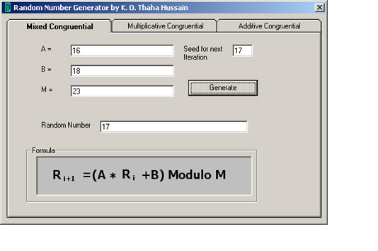



## a  \- Generate your own Random Numbers\!

### Description

This simple program generates random numbers using the basic mathematical methods. The methods are 1. Mixed Congruential 2. Multiplicative Congruential 3. Additive Congruential. Understand the simple mathematics involved! No API's used.
 
### More Info
 

             |
---                |---
**Submitted On**   |2001-06-19 12:49:00
**By**             |[K\. O\. Thaha Hussain](https://github.com/Planet-Source-Code/PSCIndex/blob/master/ByAuthor/k-o-thaha-hussain.md)
**Level**          |Beginner
**User Rating**    |3.9 (35 globes from 9 users)
**Compatibility**  |VB 6\.0
**Category**       |[Math/ Dates](https://github.com/Planet-Source-Code/PSCIndex/blob/master/ByCategory/math-dates__1-37.md)
**World**          |[Visual Basic](https://github.com/Planet-Source-Code/PSCIndex/blob/master/ByWorld/visual-basic.md)
**Archive File**   |[Generate y210886132001\.zip](https://github.com/Planet-Source-Code/k-o-thaha-hussain-a-generate-your-own-random-numbers__1-24042/archive/master.zip)

